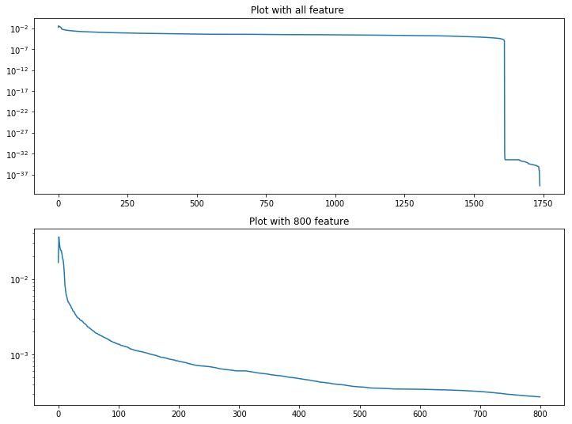
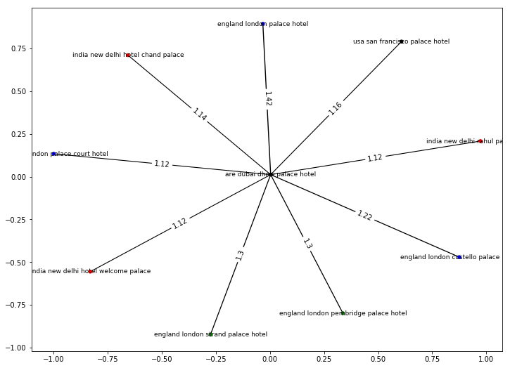

# <center> Where should I stay again (Hotel Recommendation) ? </center>

Date: **29.04. (Due: 30.04.)** <br>
Name: **Balaji Subramani** <br>
Session: **[Dimensionality-Reduction](https://textvis.repke.eu/index.html)** <br>
Code: on **[GitHub](https://github.com/balag752/Text-Visualization-Blog-2-Dimensionality-Reduction)**

## Data Source 

 As part of this analysis, we analyze the Hotel reviews from **Tripadviser**. we could find the [Trip Adviser dataset here](https://github.com/kavgan/OpinRank). This analysis is focused to **Dimensionality Reduction** technique. At the end of this blog we will find the recommended staying place based on the hostel previously stayed.
    
## Data Process & Transfer

 We have processed all cities data into **Panda Dataset**. We have additional details (City, Hotel, Timestamp) for each  review. 
 
### Hotel Dataset

 We have merged reviews in Hotel Name level. So in new dataset which we are going to do further analysis, hotel name and review is available.  
 
 
## Important Words based on city

  We have displayed the important words in each city based on the TF IDF score.

[](https://public.tableau.com/profile/balag752#!/vizhome/Text_Visualz_Blog2_Chart_1/Importantwordsbasedoncity)

# Dimensionality Reduction

In our vector space, around of **1750 words** feature. But if we create the TF IDF vector in user review level, we have more than 20,000 vectors. It is really getting huge. in some other application, it goes more than this feature counts.

### Latent Semantic Analysis

Here is the place, dimensionality reduction helps us. We have different algorithm, but as part of our analysis we are going to use the **LSA (Latent Semantic Analysis)** method.  This method is based on **SVD (Singular Value Decomposition)** dimension reduction 


SVD is more similiar to the PCA. But, **SVD is easier to inference by the sparse matrix than PCA**. Through the LSA, we could create a reduced vecor space and compare the similarities.

You could find more details **[here](https://towardsdatascience.com/pca-and-svd-explained-with-numpy-5d13b0d2a4d8)**

For SVD input, we need to change **text to numeric data**. So again we used the same TF-IDF value for each word feature. Based on the TF-IDF value we can construct the SVD components.


```python
plt.subplot(2,1,1)

plotlsa()
plt.title("Plot with all feature ")

plt.subplot(2,1,2)
plotlsa(800)
plt.title("Plot with 800 feature")

```


    Text(0.5, 1.0, 'Plot with 800 feature')





First graph shows that variance for all feautes and second graph is reduced dimension to **800 feature** and it covers the **85%** of the data. it really surprising that, with the half of the data we are able to cover the 85% of the data. it speed up our process.

# Finding the similiarity


After doing the feature reduction, we have 800 components which is explaining the 85% of dataset. Now we will focus on the finding similarity.


We are using cosine similarity to find the similarity between the hotels. This blog has lot of usefull information for [LSA Similiarity](https://simonpaarlberg.com/post/latent-semantic-analyses/). Suppose we assume that user has already lived in **are dubai dhow palace hotel** hotel and likes to stay in same kind of the hotel. Actually, they are looking a hotel in anyother city that have same characterstics like are dubai dhow palace hotel. Then this graph will give you the idea.

So based on the color of the node we can differntiate the city and edge size is explaining the similary. As per diagram, if they are planning to visit london, then they can stay in **england londan palace hotel**, that is more similar to the are dubai dhow palace hotel.


```python
graph_hotel('are dubai dhow palace hotel');
```





## Reference :

1. [Source Dataset - Trip Adviser](https://github.com/kavgan/OpinRank)
2. [Clear information about LSA Similiarity](https://simonpaarlberg.com/post/latent-semantic-analyses/)
3. [Cosine Simialarity analysis in LSA ](https://towardsdatascience.com/pca-and-svd-explained-with-numpy-5d13b0d2a4d8)
